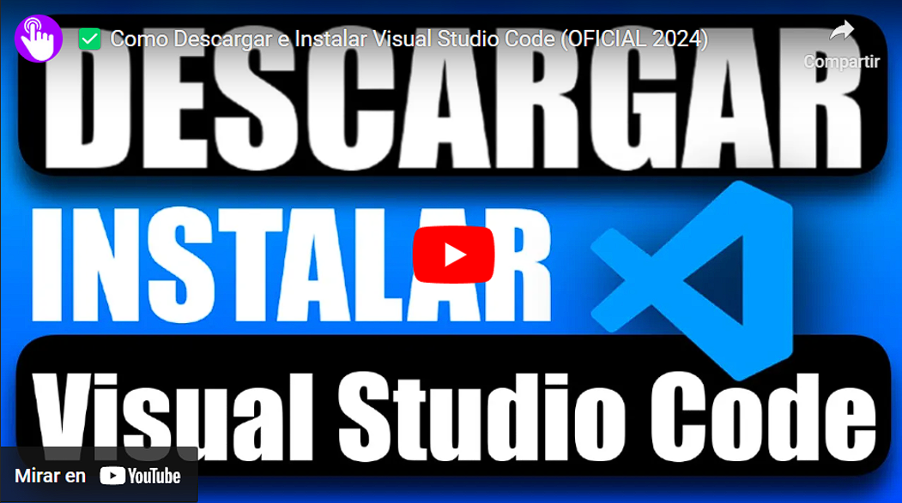

# 💽 Instalación del motor de código

Es esta sección vamos a encontrar la instalación de nuestro motor de código, existen algunos, pero por lo general se usa **VISUAL CODE.**

Instalación de Visual Studio Code

[https://youtu.be/6pD7\_rcFrj8?si=APNt3wOl0OQKQf3F](https://youtu.be/6pD7\_rcFrj8?si=APNt3wOl0OQKQf3F)

